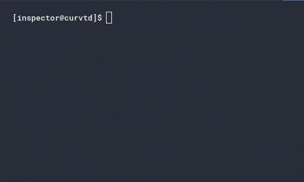
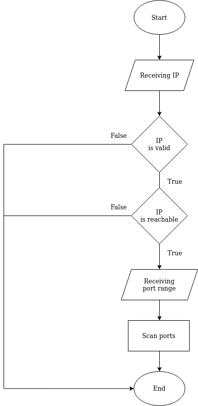

# Simple Port Scanner
[](https://forthebadge.com)


TCP/IP Connect port scanner, no external libraries. This application maintains no dependencies on third-party modules.

## Installation

### GNU / Linux

Clone this repository with `git clone` and execute the `inspector.py` file as described in the following [Usage](#usage) section.

```
$ git clone https://github.com/curvtd/inspector.git
```

## Usage



```
usage: inspector.py -i IP [-n [PORT]] [-x [PORT]] [-h]

A simple pure-python port scanner

required arguments:
  -i IP, --ip IP        		target IP address

optional arguments:
  -n [PORT], --min [PORT]		minimum port in scanning range (default = 1)
  -x [PORT], --max [PORT]		maximum port in scanning range (default = 65535)
  -h, --help            		show this help message and exit

Usage examples:
$ ./inspector.py -i 8.8.8.8
$ ./inspector.py -i 192.168.1.1 -x 1000 
```

## Flowchart



## Legal Disclaimer

The use of code contained in this repository, either in part or in its totality,
for engaging targets without prior mutual consent is illegal. **It is
the end user's responsibility to obey all applicable local, state and 
federal laws.**

Developers assume **no liability** and are not
responsible for misuses or damages caused by any code contained
in this repository in any event that, accidentally or otherwise, it comes to
be utilized by a threat agent or unauthorized entity as a means to compromise
the security, privacy, confidentiality, integrity, and/or availability of
systems and their associated resources by leveraging the exploitation of known
or unknown vulnerabilities present in said systems, including, but not limited
to, the implementation of security controls, human- or electronically-enabled.

The use of this code is **only** endorsed by the developers in those
circumstances directly related to **educational environments** or
**authorized penetration testing engagements** whose declared purpose is that
of finding and mitigating vulnerabilities in systems, limiting their exposure
to compromises and exploits employed by malicious agents as defined in their
respective threat models.

